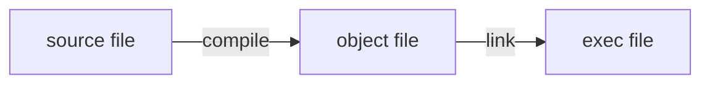

# cc-learning

This is a repository for learning to implement C Compiler.

The code is implemented with reference to 9cc.
But 9cc is inactive, so the code was implemented by the author while researching.
The code bases is no longer a 9cc transcript from the middle, so please don't refer this.

## Memo

### 2022/06/02

[リンカ・ローダ実践開発テクニック―実行ファイルを作成するために必須の技術](https://www.amazon.co.jp/%E3%83%AA%E3%83%B3%E3%82%AB%E3%83%BB%E3%83%AD%E3%83%BC%E3%83%80%E5%AE%9F%E8%B7%B5%E9%96%8B%E7%99%BA%E3%83%86%E3%82%AF%E3%83%8B%E3%83%83%E3%82%AF%E2%80%95%E5%AE%9F%E8%A1%8C%E3%83%95%E3%82%A1%E3%82%A4%E3%83%AB%E3%82%92%E4%BD%9C%E6%88%90%E3%81%99%E3%82%8B%E3%81%9F%E3%82%81%E3%81%AB%E5%BF%85%E9%A0%88%E3%81%AE%E6%8A%80%E8%A1%93-COMPUTER-TECHNOLOGY-%E5%9D%82%E4%BA%95-%E5%BC%98%E4%BA%AE/dp/4789838072) 〜p30

#### p14

実際はプリプロセスやアセンブルもあるが、リンカの実行部分を含めると下記のような流れ。
ソースコードが1ファイルでも、OS が提供するシステムコールなどとの紐付けもあるため、リンクは必要。




#### p26

オブジェクトファイルを作成して `nm` コマンドを使うと、対象ファイルが持つ symbol table を確認できる。
symbol table は symbol に対応する data type、割り当てるメモリアドレスを要素として持った配列。

symbol: 変数や関数の名前
data type: 大文字だったらグローバル、小文字だったらローカル、D はデータセクション、など `man nm`

```
cc - c foo.c
nm foo.o
```

リンク時に変数や関数にメモリ上の固定アドレスを割り当てる（再配置）。再配置は全ての symbol が出揃わないと行えない。

再配置可能な条件
1. シンボルとその実体のファイル中での位置の対応表（シンボルテーブル）がある
2. （オブジェクトファイルが？）再配置情報を持つ。実行コード中には関数呼び出しやグローバル変数の参照が多数存在するが、これらは当該アドレスへのジャンプや参照として処理が行われる。コンパイル時にはこれらのアドレスは未定。よって、再配置可能であるためには、これらは「未解決のシンボル」として実際のアドレスの部分が空欄となっており、後で補填できるように補填するための情報（再配置情報）を別に保持している必要がある。

シンボル情報は関数や変数の定義・実体ごとに存在するのに対し、再配置情報は関数や変数の呼び出し・利用ごとに存在する。（呼び出しごとに異なるアドレスに飛ばされるということ？実体は1つなのになぜ？）

リンカの動作
1. 関数や変数の実体が存在するセクションを、実際のメモリのアドレス上に割り当てる
2. シンボルテーブルに登録されている関数や変数が、どのアドレスに配置されたかの DB を作成（シンボルテーブルを利用）
3. 再配置テーブルを参照し、関数・変数呼び出し部分の空欄に実際のアドレスを補填 -> 「名前解決」「シンボル解決」（このとき補填されるアドレスは 1. のアドレスと異なるのか？）

### 2022/06/01

"ステップ14: 関数の呼び出しに対応する" の下記がわからないため調査中。

> テストではint foo() { printf("OK\n"); }のような内容のCファイルを用意しておいて、それをcc -cでオブジェクトファイルにコンパイルして、自分のコンパイラの出力とリンクします。そうすると全体としてきちんとリンクできて、自分の呼び出したい関数がきちんと呼ばれていることも確認できるはずです。

下記のやり方を調べているが、少し脱線してリンカについて簡単に勉強することにした。

> 自分のコンパイラの出力とリンク

概要把握に留める。

[リンカ・ローダ実践開発テクニック―実行ファイルを作成するために必須の技術](https://www.amazon.co.jp/%E3%83%AA%E3%83%B3%E3%82%AB%E3%83%BB%E3%83%AD%E3%83%BC%E3%83%80%E5%AE%9F%E8%B7%B5%E9%96%8B%E7%99%BA%E3%83%86%E3%82%AF%E3%83%8B%E3%83%83%E3%82%AF%E2%80%95%E5%AE%9F%E8%A1%8C%E3%83%95%E3%82%A1%E3%82%A4%E3%83%AB%E3%82%92%E4%BD%9C%E6%88%90%E3%81%99%E3%82%8B%E3%81%9F%E3%82%81%E3%81%AB%E5%BF%85%E9%A0%88%E3%81%AE%E6%8A%80%E8%A1%93-COMPUTER-TECHNOLOGY-%E5%9D%82%E4%BA%95-%E5%BC%98%E4%BA%AE/dp/4789838072)

## Assembler

x86-64

- the x86-64 integer arithmetic instruction normally accepts only two registers, so the result is stored by overwriting the value of the first argument register

### function

- the first argument is placed in the RDI register and the second argument is placed in the RSI register
- the return value is put into RAX register

### instructions

#### mov

- copy the value of a register

#### call

- push the address of the next instruction of call to stack
- jump to the address given as the argument of call

#### ret

- pop one address from the stack top and jump to the address

## Reference

- [9cc](https://github.com/rui314/9cc)
- [chibicc](https://github.com/rui314/chibicc)
- [低レイヤを知りたい人のためのCコンパイラ作成入門](https://www.sigbus.info/compilerbook)
