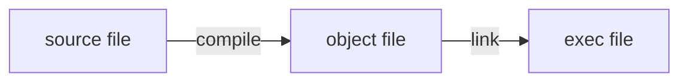
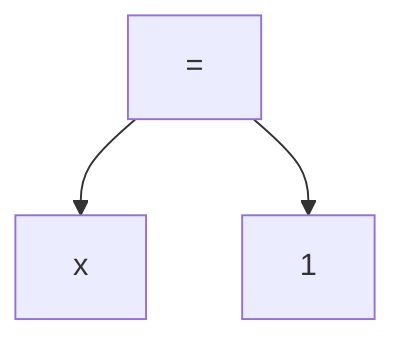
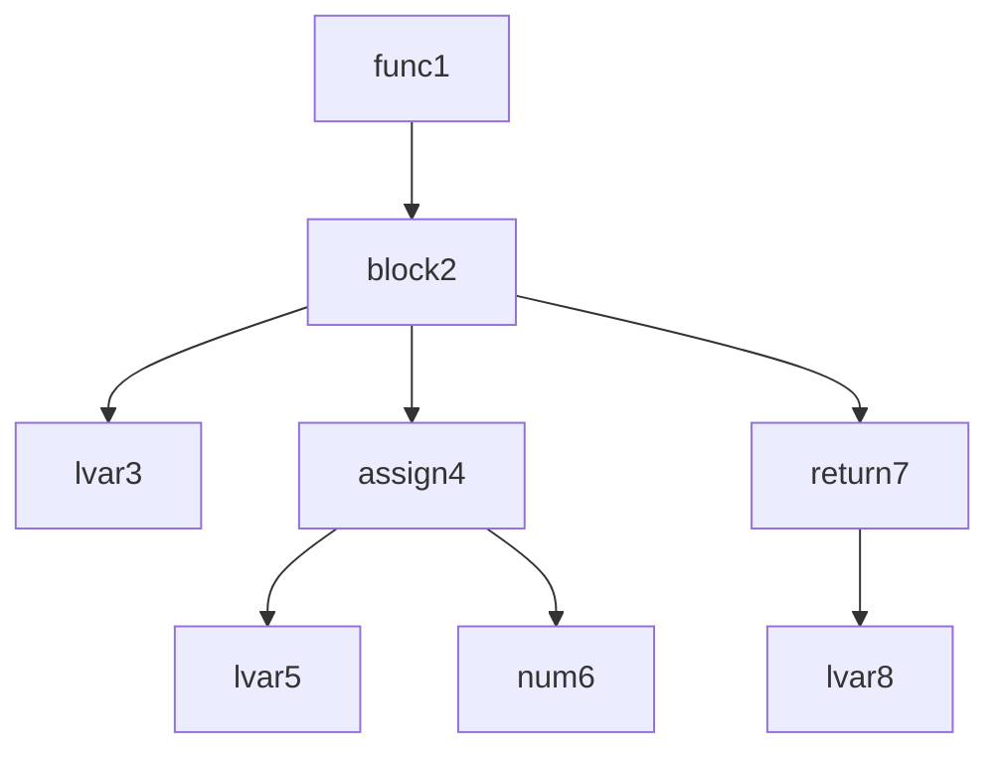

# cc-learning

This is a repository for learning to implement C Compiler.

The code is implemented with reference to 9cc.
But 9cc is inactive, so the code was implemented by the author while researching.
The code bases is no longer a 9cc transcript from the middle, so please don't refer this.

## Reference

- [9cc](https://github.com/rui314/9cc)
- [chibicc](https://github.com/rui314/chibicc)
- [低レイヤを知りたい人のためのCコンパイラ作成入門](https://www.sigbus.info/compilerbook)

## Memo

### 2022/06/01

"ステップ14: 関数の呼び出しに対応する" の下記がわからないため調査中。

> テストではint foo() { printf("OK\n"); }のような内容のCファイルを用意しておいて、それをcc -cでオブジェクトファイルにコンパイルして、自分のコンパイラの出力とリンクします。そうすると全体としてきちんとリンクできて、自分の呼び出したい関数がきちんと呼ばれていることも確認できるはずです。

下記のやり方を調べているが、少し脱線してリンカについて簡単に勉強することにした。

> 自分のコンパイラの出力とリンク

概要把握に留める。

[リンカ・ローダ実践開発テクニック―実行ファイルを作成するために必須の技術](https://www.amazon.co.jp/%E3%83%AA%E3%83%B3%E3%82%AB%E3%83%BB%E3%83%AD%E3%83%BC%E3%83%80%E5%AE%9F%E8%B7%B5%E9%96%8B%E7%99%BA%E3%83%86%E3%82%AF%E3%83%8B%E3%83%83%E3%82%AF%E2%80%95%E5%AE%9F%E8%A1%8C%E3%83%95%E3%82%A1%E3%82%A4%E3%83%AB%E3%82%92%E4%BD%9C%E6%88%90%E3%81%99%E3%82%8B%E3%81%9F%E3%82%81%E3%81%AB%E5%BF%85%E9%A0%88%E3%81%AE%E6%8A%80%E8%A1%93-COMPUTER-TECHNOLOGY-%E5%9D%82%E4%BA%95-%E5%BC%98%E4%BA%AE/dp/4789838072)

### 2022/06/02

[リンカ・ローダ実践開発テクニック―実行ファイルを作成するために必須の技術](https://www.amazon.co.jp/%E3%83%AA%E3%83%B3%E3%82%AB%E3%83%BB%E3%83%AD%E3%83%BC%E3%83%80%E5%AE%9F%E8%B7%B5%E9%96%8B%E7%99%BA%E3%83%86%E3%82%AF%E3%83%8B%E3%83%83%E3%82%AF%E2%80%95%E5%AE%9F%E8%A1%8C%E3%83%95%E3%82%A1%E3%82%A4%E3%83%AB%E3%82%92%E4%BD%9C%E6%88%90%E3%81%99%E3%82%8B%E3%81%9F%E3%82%81%E3%81%AB%E5%BF%85%E9%A0%88%E3%81%AE%E6%8A%80%E8%A1%93-COMPUTER-TECHNOLOGY-%E5%9D%82%E4%BA%95-%E5%BC%98%E4%BA%AE/dp/4789838072) 〜p30

#### p14

実際はプリプロセスやアセンブルもあるが、リンカの実行部分を含めると下記のような流れ。
ソースコードが1ファイルでも、OS が提供するシステムコールなどとの紐付けもあるため、リンクは必要。




#### p26

オブジェクトファイルを作成して `nm` コマンドを使うと、対象ファイルが持つ symbol table を確認できる。
symbol table は symbol に対応する data type、割り当てるメモリアドレスを要素として持った配列。

symbol: 変数や関数の名前
data type: 大文字だったらグローバル、小文字だったらローカル、D はデータセクション、など `man nm`

```
cc - c foo.c
nm foo.o
```

リンク時に変数や関数にメモリ上の固定アドレスを割り当てる（再配置）。再配置は全ての symbol が出揃わないと行えない。

再配置可能な条件
1. シンボルとその実体のファイル中での位置の対応表（シンボルテーブル）がある
2. （オブジェクトファイルが？）再配置情報を持つ。実行コード中には関数呼び出しやグローバル変数の参照が多数存在するが、これらは当該アドレスへのジャンプや参照として処理が行われる。コンパイル時にはこれらのアドレスは未定。よって、再配置可能であるためには、これらは「未解決のシンボル」として実際のアドレスの部分が空欄となっており、後で補填できるように補填するための情報（再配置情報）を別に保持している必要がある。

シンボル情報は関数や変数の定義・実体ごとに存在するのに対し、再配置情報は関数や変数の呼び出し・利用ごとに存在する。（呼び出しごとに異なるアドレスに飛ばされるということ？実体は1つなのになぜ？）

リンカの動作
1. 関数や変数の実体が存在するセクションを、実際のメモリのアドレス上に割り当てる
2. シンボルテーブルに登録されている関数や変数が、どのアドレスに配置されたかの DB を作成（シンボルテーブルを利用）
3. 再配置テーブルを参照し、関数・変数呼び出し部分の空欄に実際のアドレスを補填 -> 「名前解決」「シンボル解決」（このとき補填されるアドレスは 1. のアドレスと異なるのか？）

### 2022/06/04

リンカの動作の概要は知れたので、一度実装に戻る。

local 変数の定義に関する実装が足りなかった & 理解が曖昧だったため、簡単にメモる。

parser はトークンを意味のあるまとまりで Node にまとめていく -> トークン間の関係を解析して AST を作成する。
local variable について言えば、`x=1` を parse するのは assign parser の役割。
assign parser は `x=1` を下記のようなツリーとして構成する。



左の子ノード `x` は primary parser で parse される。このとき `x` ノードに持たせる情報は、`name`, `len`, `kind`, `offset`。
`offset` ローカル変数が定義されたアクティベーションレコードにおける RBP（Stack の Base Pointer）からのオフセット。`name` を持たせるのは、そのアクティベーションレコードにおいて、重複した変数が異なるメモリに割り当てられないように判別するため。

#### Step14 引数なしの関数をコンパイル

`foo();` のような関数呼び出しをコンパイルして実行できるようになった。
といってもアセンブラは `call foo` のみ。やり方は、

1. 関数の実体は別途 C ファイルを用意
```c
// foo.c
#include <stdio.h>

int foo(){
	printf("foo!!");
}
```

2. foo.c を `cc -c foo.c` でコンパイルしオブジェクトファイル `foo.o` を作成
3. `foo();` を自作コンパイラでコンパイルしたアセンブリ `tmp.s` を用意する（`call foo` が含まれる）
4. `cc -o tmp.s foo.o` を実行して `tmp.s` と `foo.o` をリンクし、`foo` を実行する

#### Step14 引数ありの関数をコンパイル

- x86-64 ABI calling conventions に従い実装する
https://en.wikipedia.org/wiki/X86_calling_conventions#x86-64_calling_conventions

ドキュメント通りのレジスタに引数をセットするのみのため、整数については特に苦労しない。


[1つ目の引数をとれるようにしたコミット](https://github.com/yryrgogo/cc-learning/commit/0c08dd64cbe83b2009e8619a31373cdf66913a2)

そろそろリファクタしたくなってくるが、フィボナッチ数列くらい出力できるようにしてもう少し全体感を掴んでかr検討する。

### 2022/06/05

Step15 の実装を始めた。

関数がアセンブラでどのように書かれているのかよくわかっていないため、簡単なコードをコンパイルして確認する。

`cc -c ./sample/simple.c && objdump -d simple > simple_assemble.md`

ただ cc を使った影響か、`call instruction` の出力が自分の見知っている構文と異なったので結局 https://godbolt.org/ で gcc の出力を調べた。
手元だと `callq  74 <main+0xe>` で `0000000000000000 <foo>` が呼ばれるらしいのだが、なぜ？という感じ。godbolt (gcc 12.1) だと `call foo` で `foo` が呼ばれているので大変わかりやすい。objdump の使い方が悪いのか？

godbolt のおかげで関数のコンパイル方法がなんとなくわかったので、実装していく。

### 2022/06/10

関数呼び出しにおける命令と Stack がどう使われてるか理解。

```
foo() {
  2;
}

main() {
  foo();
  0;
}
```

下記のアセンブラは正常に動く。
call から Stack を追うと、

1. call foo / stack: ["return address"]
2. push rbp / stack: ["rbp", "return address"]
3. push 2   / stack: ["2", "rbp", "return address"]
4. pop rax  / stack: ["rbp", "return address"]
5. pop rbp  / stack: ["return address"]
6. ret      / stack: []
7. push 0 (at main)

```
.intel_syntax noprefix
.globl main
foo:
  push rbp
  mov rbp, rsp
  sub rsp, 0
  push 2
  pop rax
  pop rbp
  ret
main:
  push rbp
  mov rbp, rsp
  sub rsp, 0
  call foo
  push 0
  pop rax
  push 0
  pop rax
  mov rsp, rbp
  pop rbp
  ret
```

### 2022/06/12

[低レイヤを知りたい人のためのCコンパイラ作成入門](https://www.sigbus.info/compilerbook)の序盤は簡単のためかアドホックに `push rax` や `pop rax` の命令を generate しているため、他の命令やネスト、複数の statement 対応をする上では整理する必要があった。
手元のテストは通っていたのだが、stack の値の処理において push, pop の対応がとれておらず、関数のエピローグにおける `pop rbp` で pop される値が、`rbp` でなくなるコードがいくつかあった (if, call, multiple statement)。
[3ba5d03](https://github.com/yryrgogo/cc-learning/commit/3ba5d034bd040cecb700bebef46c8ee5e31dcbd3) あたりでこれを整理した。

再帰関数のコンパイルで無限ループが発生し、再帰のための実装が足りないと思ったが、関数の引数として TK_NUM 以外のトークンの処理が実装されていないためだった。C の print デバッグにやりづらさを感じるため gdb 便利。

### 2022/06/13

シンプルな再帰関数は動くようになったが、引数に式を渡すと、正常に動作しない。原因は引数の処理を1つ目から順に行っているため。rdi が2つ目以降の引数で書き換えられてしまっている。引数は後ろか処理するように修正した。

フィボナッチ数列が再帰で出力可能可能になった。
[03f5326](https://github.com/yryrgogo/cc-learning/commit/03f53263ca8a0ff9e51cb1c05220c3fcb69c3ce8)

### 2022/06/18

Step18. のポインタ型実装を開始。`struct Type` を実装するようアドバイスがあるが、この用途をいまいちわかっていないので整理中。

code 生成する際の AST を可視化できた方がデバッグがはかどると思っていたものの面倒で着手していなかったが、やっぱあったほうがよいと思い、脱線して実装を始めた。
下記ぐらいは出力可能になったので、あとはコンパイラの実装をしながら必要に応じて機能追加・改善する。Node の通し番号を振っているが、変数名とか値とかがあってもよいかも。

### 2022/06/27

Step21. の配列とポインタ型の暗黙の型変換を実装中。
int のポインタ型との微妙な違いをうまく吸収できていない。
int ポインタ型だと、`a` のアドレスにはポインタが指すアドレスが格納されている。しかし、配列だと `a` は配列の先頭のアドレスを指すものの、そのアドレスには配列の最初の値 `a[0]` が格納されている。これが大きな違いであり、面倒なところである。添字アクセスされているときとそうでないときをメンバで判別可能にすればよいだけか？

### 2022/06/29

ハマっている。ローカル変数のメモリを Stack に確保する際、rbp をベースにしてマイナス方向に確保しているが、これだと配列や通常のポインタ演算と逆方向にアドレスを動かすことになる。
おそらく、「低レイヤを知りたい人のためのCコンパイラ作成入門」の初期実装は簡単のために rbp から近い順に確保するよう実装していたのだと思われる（？）。本来は rbp のマイナス方向に領域を確保しつつも、その関数を実行するのに必要な領域を計算した上で、その末端からプラス方向に変数を確保するべきなのだろう（配列と近いイメージ）

トリッキーな条件分岐で回避してきたが、これ以上アドホックに対応すると余計な問題を生みそうな気がするので直しどきか？ただ関数のアクティベーションレコードの領域を確認した上で変数を格納するには、先にアクティベーションレコードの領域を知るための処理を走らせる必要がある？

```
int main() {
	int a;
	a = 5;
	return a;
}
```



### 2022/06/19

switch の break 忘れてバグらせハマりがち。
ND_DEREF の codegen は左辺と右辺で異なるため、その対応を行った。これにより `*y = 5;` のようなポインタ型への代入もコンパイル可能になった。

ポインタ型を実装することでコンパイル可能にしたいのは下記のようなコード。

```
#include <stdio.h>

int main() {

  int x = 5;
  int *y = &x;

  *y = 10;
  printf("%d\n", x);   // 10
  printf("%d\n", y);   // 1286778196
  printf("%d\n", *y);  // 10

  int **z = &y;
  printf("%d\n", z);   // 1286778184
  printf("%d\n", *z);  // 1286778196
  printf("%d\n", **z); // 10

  return 0;
}
```


## 注意事項

### RSP

https://www.sigbus.info/compilerbook#%E3%82%B9%E3%83%86%E3%83%83%E3%83%9714-%E9%96%A2%E6%95%B0%E3%81%AE%E5%91%BC%E3%81%B3%E5%87%BA%E3%81%97%E3%81%AB%E5%AF%BE%E5%BF%9C%E3%81%99%E3%82%8B
> 関数呼び出しをする前にRSPが16の倍数になっていなければいけません。pushやpopはRSPを8バイト単位で変更するので、call命令を発行するときに必ずしもRSPが16の倍数になっているとは限りません。この約束が守られていない場合、RSPが16の倍数になっていることを前提にしている関数が、半分の確率で落ちる謎の現象に悩まされることにmなります。関数を呼ぶ前にRSPを調整するようにして、RSPを16の倍数になるように調整するようにしましょう。

## Assembler

x86-64

- the x86-64 integer arithmetic instruction normally accepts only two registers, so the result is stored by overwriting the value of the first argument register

### function

- the first argument is placed in the RDI register and the second argument is placed in the RSI register
- the return value is put into RAX register

### instructions

| instruction | explain |
| --- | --- |
| mov | copy the value of a register |
| movzb | レジスタの値をゼロクリアした上で指定された値をコピーしてくる <br /> AL レジスタのように RAX の下位8ビットのみを指す8ビットレジスタを使うと、上位56ビットの値は前の値のままになるため、movzb を使ってゼロクリアする必要がある |
| call | push the address of the next instruction of call to stack<br /> jump to the address given as the argument of call |
| ret | pop one address from the stack top and jump to the address |
| cmp | x86-64では比較命令の結果は「フラグレジスタ」にセットされる <br /> フラグレジスタは整数演算や比較演算命令が実行されるたびに更新されるレジスタ。結果が0かどうかや桁あふれが発生したかどうか、結果が0未満かどうかといったビットを持つ |
| sete | `==` <br > 直前の cmp 命令で調べた2つのレジスタの値が同じだった場合に、指定されたレジスタに1をセット、それ以外の場合は0をセット <br /> 8ビットレジスタしか引数にとれない |
| setne | `!=` <br /> |
| setle | `<=` |
| setl | `<` |
