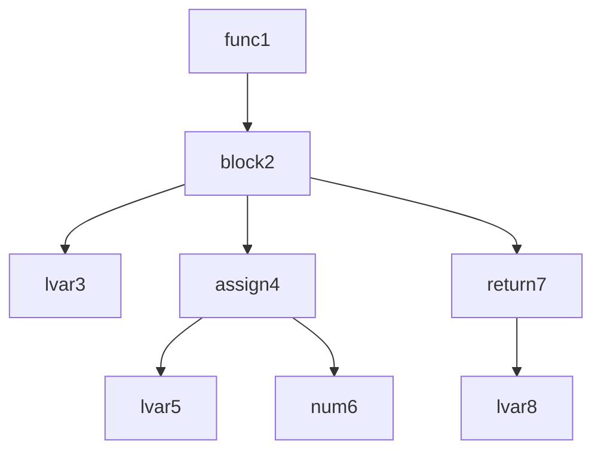

```mermaid
flowchart TB

func1[func1]
block2[block2]
func1 --> block2

lvar3[lvar3]
block2 --> lvar3


assign4[assign4]
block2 --> assign4

lvar5[lvar5]
assign4 --> lvar5

num6[num6]
assign4 --> num6


return7[return7]
block2 --> return7

lvar8[lvar8]
return7 --> lvar8

%% gen_graph


```
